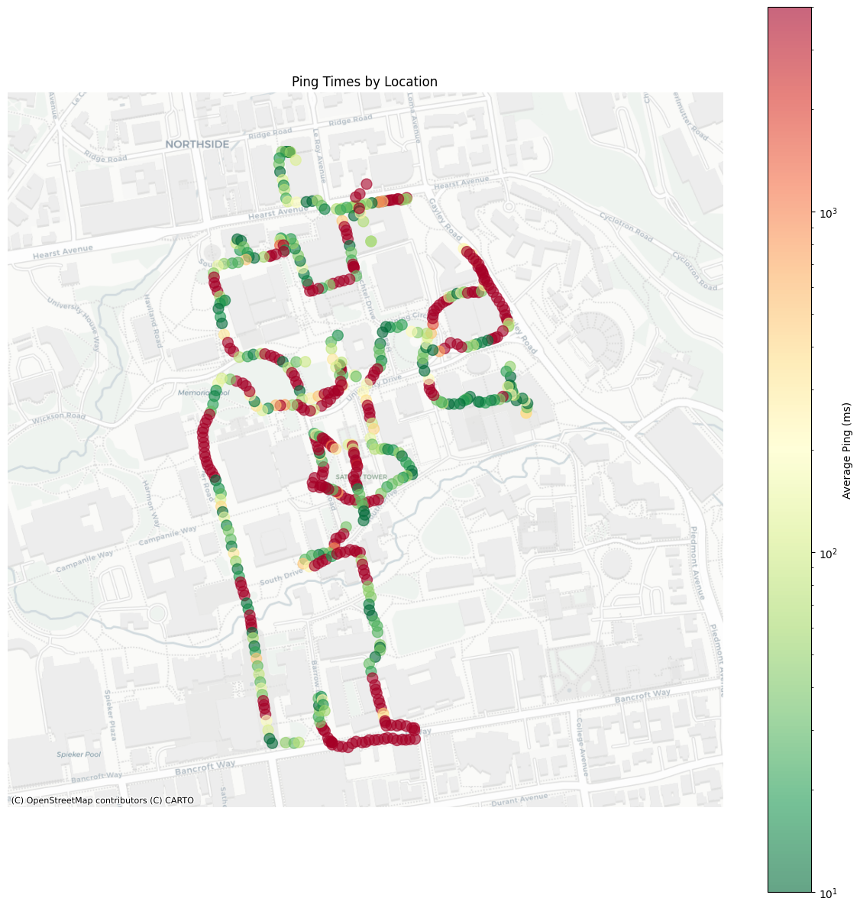
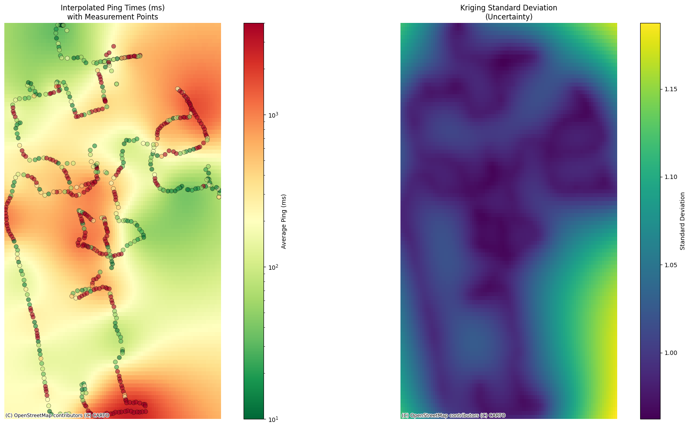
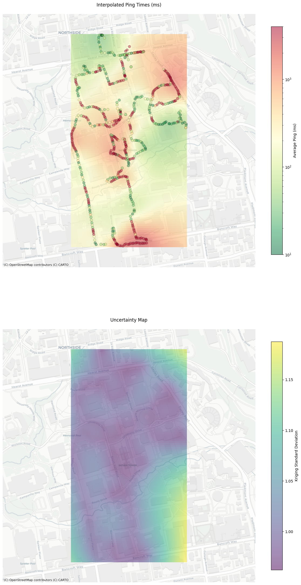

# WiFi Signal Performance Mapping

A Python-based tool for mapping and visualizing WiFi network performance across physical spaces using Ordinary Kriging interpolation. This project combines network performance metrics with GPS coordinates to create heatmaps of network quality.

*Figure 1: Raw ping times mapped to physical locations*

*Figure 2: Interpolated ping times heatmap and Kringing Standard Deviation (Uncertainity)

*Figure 3: Interpolated ping times heatmap and Kringing Standard Deviation (Uncertainity) Heatmap overlayed on physical location.

